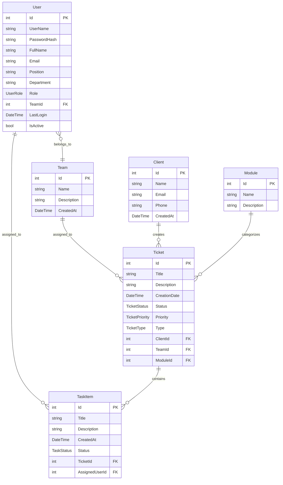

# 🔧 Technical Documentation - CliniSys Ticket Management System

## 📋 Table of Contents

- [System Architecture](#system-architecture)
- [Authentication System](#authentication-system)
- [Data Model & Class Diagram](#data-model--class-diagram)
- [Data Flow & API Endpoints](#data-flow--api-endpoints)
- [Database Design](#database-design)
- [Frontend Architecture](#frontend-architecture)
- [Security Implementation](#security-implementation)
- [Performance Considerations](#performance-considerations)

---

## 🏗️ System Architecture

### **Technology Stack**

- **Backend**: ASP.NET Core 8.0 MVC
- **Database**: SQL Server with Entity Framework Core
- **Frontend**: Razor Views + JavaScript (Vanilla)
- **Authentication**: JWT + Session-based hybrid approach
- **Styling**: Custom CSS with responsive design

### **Project Structure**

```
GestionTicketClinisys/
├── Controllers/           # MVC Controllers (Business Logic)
├── Models/               # Data Models & Entities
├── Services/             # Business Services & Interfaces
├── Views/                # Razor Views (UI)
├── wwwroot/             # Static Assets (CSS, JS, Images)
├── Migrations/          # EF Core Database Migrations
└── Program.cs           # Application Configuration
```

---

## 🔐 Authentication System

### **Hybrid Authentication Approach**

We implemented a **JWT + Session hybrid** system for optimal security and user experience:

#### **1. JWT Token Generation**

```csharp
// In JwtService.cs
public string GenerateToken(User user)
{
    var tokenHandler = new JwtSecurityTokenHandler();
    var key = Encoding.ASCII.GetBytes(_secretKey);
    var tokenDescriptor = new SecurityTokenDescriptor
    {
        Subject = new ClaimsIdentity(new[]
        {
            new Claim("UserId", user.Id.ToString()),
            new Claim("UserName", user.UserName),
            new Claim("Role", user.Role.ToString())
        }),
        Expires = DateTime.UtcNow.AddHours(24),
        SigningCredentials = new SigningCredentials(new SymmetricSecurityKey(key),
            SecurityAlgorithms.HmacSha256Signature)
    };
    var token = tokenHandler.CreateToken(tokenDescriptor);
    return tokenHandler.WriteToken(token);
}
```

#### **2. Session Storage**

```csharp
// In HomeController.cs - Login method
HttpContext.Session.SetString("AuthToken", token);
HttpContext.Session.SetString("UserId", user.Id.ToString());
HttpContext.Session.SetString("UserName", user.UserName);
HttpContext.Session.SetString("UserRole", user.Role.ToString());
```

#### **3. Authentication Validation**

```csharp
// Used in all controllers
private bool IsUserAuthenticated()
{
    var token = HttpContext.Session.GetString("AuthToken");
    if (string.IsNullOrEmpty(token)) return false;
    return _jwtService.ValidateToken(token);
}
```

### **Why This Approach?**

- **JWT**: Stateless, secure, contains user claims
- **Session**: Server-side storage, automatic cleanup, better UX
- **Hybrid Benefits**: Security + Performance + User Experience

---

## 📊 Data Model & Class Diagram

### **Core Entities**



### **Key Relationships**

1. **User ↔ Team**: Many-to-One (Users belong to teams)
2. **Team ↔ Ticket**: One-to-Many (Teams handle multiple tickets)
3. **Ticket ↔ TaskItem**: One-to-Many (Tickets contain multiple tasks)
4. **User ↔ TaskItem**: One-to-Many (Users are assigned tasks)

### **Business Logic Constraints**

- **Tickets** are assigned to **Teams** (not individual users)
- **Tasks** within a ticket can only be assigned to **users from that team**
- This ensures proper workflow and team responsibility

---

## 🔄 Data Flow & API Endpoints

### **Data Fetching Pattern**

We use **Entity Framework Core** with **Include()** for eager loading:

```csharp
// Example: Fetching tickets with related data
var tickets = await _context.Tickets
    .Include(t => t.Client)
    .Include(t => t.Team)
    .Include(t => t.Module)
    .OrderByDescending(t => t.CreationDate)
    .ToListAsync();
```

### **Key API Endpoints**

#### **Authentication**

- `POST /Home/Login` - User authentication
- `POST /Home/Logout` - Session termination

#### **Ticket Management**

- `GET /Tickets/GestionDemandes` - View all tickets (Admin/Manager)
- `POST /Tickets/Create` - Create new ticket
- `PUT /Tickets/Edit/{id}` - Update ticket
- `DELETE /Tickets/Delete/{id}` - Delete ticket

#### **Task Management**

- `GET /Tasks/MesTaches` - User's assigned tasks
- `GET /DemandeClasses/Index` - Advanced task management
- `POST /Tasks/Create` - Create task for ticket
- `PUT /Tasks/UpdateStatus` - Update task status

#### **Profile & Data**

- `GET /Profile/Index` - User profile
- `GET /Profile/GetRecentActivity` - User's task activities
- `POST /Home/SeedAllData` - Generate test data

### **AJAX Data Flow Example**

```javascript
// Frontend: Fetching user activities
fetch("/Profile/GetRecentActivity")
  .then((response) => response.json())
  .then((data) => {
    if (data.success) {
      // Update UI with real task data
      displayActivities(data.activities);
    }
  });
```

---

## 🗄️ Database Design

### **Migration Strategy**

We use **Entity Framework Core Migrations** for database versioning:

```bash
# Create migration
dotnet ef migrations add MigrationName

# Apply to database
dotnet ef database update
```

### **Key Migrations**

1. `InitialModel` - Base entities
2. `AddUserPassword` - Authentication fields
3. `AddEnhancedTicketFields` - Extended ticket properties
4. `RemoveUserIdFromTickets` - Business logic correction
5. `AddNavigationProperties` - Relationship improvements

### **Database Seeding**

Comprehensive test data generation:

- 8 Users across different teams
- 12 Clients with realistic data
- 8 Teams with specific roles
- 18 Modules for categorization
- 50+ Tickets with varied statuses
- Tasks assigned based on team membership

---

## 🎨 Frontend Architecture

### **View Structure**

- **Razor Views**: Server-side rendering with C# integration
- **Partial Views**: Reusable components
- **Layout System**: Consistent UI structure

### **JavaScript Organization**

```
wwwroot/js/
├── site.js              # Global utilities
├── MesTaches.js         # Task management
├── DemandeClasses.js    # Advanced ticket management
└── Guide.js             # User guide functionality
```

### **CSS Architecture**

```
wwwroot/css/
├── login.css            # Authentication pages
├── Menu.css             # Main navigation
├── GestionDemandes.css  # Ticket management
├── MesTaches.css        # Task views
└── Guide.css            # Documentation styling
```

### **Responsive Design**

- **Mobile-first approach**
- **Flexbox/Grid layouts**
- **Breakpoint-based media queries**
- **Touch-friendly interfaces**

---

## 🔒 Security Implementation

### **Password Security**

```csharp
// Password hashing using BCrypt
public string HashPassword(string password)
{
    return BCrypt.Net.BCrypt.HashPassword(password);
}

public bool VerifyPassword(string password, string hash)
{
    return BCrypt.Net.BCrypt.Verify(password, hash);
}
```

### **Authorization Levels**

1. **Admin**: Full system access
2. **Manager**: Team management + ticket oversight
3. **User**: Personal tasks + limited ticket creation

### **Session Security**

- **Automatic expiration**
- **Secure token validation**
- **Role-based access control**
- **CSRF protection** with AntiForgeryToken

---

## ⚡ Performance Considerations

### **Database Optimization**

- **Eager Loading**: Reduce N+1 queries with Include()
- **Pagination**: Limit data transfer for large datasets
- **Indexing**: Optimized queries on frequently searched fields

### **Frontend Performance**

- **Minimal JavaScript**: Vanilla JS for better performance
- **CSS Optimization**: Modular, non-blocking stylesheets
- **Image Optimization**: Compressed assets
- **Caching Strategy**: Browser caching for static resources

### **Real-time Features**

- **Auto-updating timestamps**: JavaScript intervals for pending times
- **Dynamic filtering**: Client-side search and filtering
- **Responsive interactions**: Smooth animations and transitions

---

## 🎯 Key Technical Decisions

### **Why MVC Pattern?**

- **Separation of Concerns**: Clear business logic separation
- **Testability**: Easy unit testing of controllers and services
- **Scalability**: Modular architecture for future expansion

### **Why Hybrid Authentication?**

- **Security**: JWT provides stateless security
- **UX**: Sessions provide seamless user experience
- **Flexibility**: Easy to extend for API access

### **Why Entity Framework?**

- **Code-First**: Database schema from C# models
- **Migration Support**: Version-controlled database changes
- **LINQ Integration**: Type-safe database queries
- **Relationship Management**: Automatic foreign key handling

This architecture provides a **robust, scalable, and maintainable** ticket management system with modern web development practices.

---

## 🤔 Common Interview Questions & Answers

### **Q: How does your authentication system work?**

**A:** We use a hybrid JWT + Session approach:

1. **Login**: User credentials verified against BCrypt-hashed passwords
2. **JWT Generation**: Create signed token with user claims (ID, role, username)
3. **Session Storage**: Store token and user info in server-side session
4. **Validation**: Each request validates JWT token from session
5. **Benefits**: Stateless security (JWT) + seamless UX (sessions)

### **Q: Explain your data model relationships**

**A:** Our system follows a hierarchical business model:

- **Users** belong to **Teams** (many-to-one)
- **Tickets** are assigned to **Teams** (not individuals)
- **Tasks** within tickets are assigned to **Users** from that team
- This ensures proper workflow: Team gets ticket → Team members handle tasks

### **Q: How do you handle data fetching and performance?**

**A:** We use several optimization strategies:

- **Entity Framework Include()**: Eager loading to prevent N+1 queries
- **Async/Await**: Non-blocking database operations
- **Pagination**: Limit data transfer for large datasets
- **Client-side filtering**: Reduce server requests
- **Real-time updates**: JavaScript intervals for dynamic content

### **Q: What security measures are implemented?**

**A:** Multiple security layers:

- **Password Hashing**: BCrypt for secure password storage
- **JWT Tokens**: Signed tokens with expiration
- **Session Management**: Server-side session validation
- **Role-based Access**: Different permissions for Admin/Manager/User
- **CSRF Protection**: AntiForgeryToken on forms
- **Input Validation**: Server and client-side validation

### **Q: How is the frontend organized?**

**A:** Clean separation of concerns:

- **Razor Views**: Server-side rendering with C# integration
- **Modular CSS**: Page-specific stylesheets
- **Vanilla JavaScript**: Lightweight, no framework dependencies
- **Responsive Design**: Mobile-first approach
- **Component Reusability**: Partial views and shared layouts

### **Q: Explain your database migration strategy**

**A:** We use Entity Framework Code-First migrations:

- **Version Control**: Each schema change is a tracked migration
- **Rollback Capability**: Can revert database changes
- **Team Collaboration**: Migrations shared across development team
- **Production Safety**: Migrations tested before deployment

---

## 🚀 Deployment & Environment Setup

### **Development Environment**

```bash
# Prerequisites
- .NET 8.0 SDK
- SQL Server (LocalDB or full instance)
- Visual Studio 2022 or VS Code

# Setup Steps
1. Clone repository
2. Update connection string in appsettings.json
3. Run: dotnet ef database update
4. Run: dotnet run
5. Navigate to: http://localhost:5296
```

### **Production Considerations**

- **Connection Strings**: Environment-specific configurations
- **JWT Secrets**: Secure key management
- **Database**: SQL Server with proper indexing
- **Logging**: Structured logging with Serilog
- **Error Handling**: Global exception handling
- **Performance Monitoring**: Application insights

---

## 📈 Future Enhancements

### **Planned Features**

1. **Real-time Notifications**: SignalR for instant updates
2. **File Attachments**: Document management for tickets
3. **Reporting Dashboard**: Analytics and metrics
4. **API Layer**: RESTful API for mobile apps
5. **Advanced Search**: Full-text search capabilities
6. **Audit Trail**: Complete action logging
7. **Email Integration**: Automated notifications

### **Scalability Improvements**

- **Caching Layer**: Redis for session and data caching
- **Database Optimization**: Query optimization and indexing
- **Load Balancing**: Multiple application instances
- **Microservices**: Service decomposition for large scale

---

## 🔍 Code Quality & Best Practices

### **Design Patterns Used**

- **MVC Pattern**: Model-View-Controller separation
- **Repository Pattern**: Data access abstraction
- **Service Layer**: Business logic encapsulation
- **Dependency Injection**: Loose coupling and testability

### **Code Standards**

- **Async/Await**: Non-blocking operations
- **SOLID Principles**: Clean, maintainable code
- **Error Handling**: Try-catch with proper logging
- **Validation**: Both client and server-side
- **Documentation**: Comprehensive code comments

This technical foundation ensures the system is **production-ready**, **maintainable**, and **scalable** for enterprise use.
